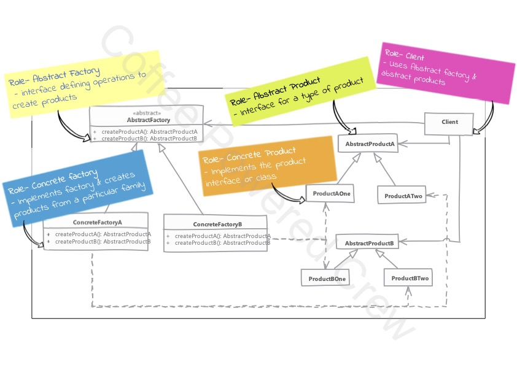

# Abstract Factory

> **Abstract Factory** resuelve específicamente el problema relacionado con "<u>familias de productos</u>".

### Uso

 Su uso es muy específico, ya que trabaja con base a la implementación de una familia de objetos a la vez, es decir, se
 pueden declarar varias familias de objetos, pero sólo una familia se puede utilizar.
 
 - Cuando se tienen múltiples colecciones de objetos donde una colección de objetos trabajan de manera conjunta,
   entonces se puede implementar el **Abstract Factory** para encapsular el código de los objetos y sus factories.
 - **Abstract Factory** implementa el patrón **Method Factory** por lo que se puede pensar como objetos con múltiples 
   factories.
 - Agregar un nuevo tipo de objetos requerirá cambios en la clase base del **Abstract Factory** y todas sus 
   implementaciones.
 - Los factories pueden ocupar el patrón **Singleton** ya que en la vida real por lo regular sólo se requiere una única
   instancia.

Al momento de utilizar este patrón es difícil visualizar su necesidad pues requerirá que primero implementemos el patrón
**Method Factory**, posteriormente requeriremos ampliar este patrón para implementar el **Abstract Factory**. Agregar
más implementaciones de familias de objetos complicará este patrón y el trabajo de mantenimiento. Cuando se tienen que
generar objetos costosos o difíciles de instanciar se puede combinar con el patrón **Prototype** para clonar el objeto.

