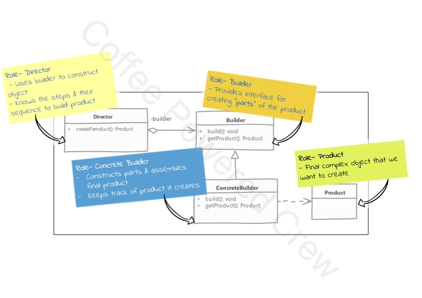

# Builder Pattern

Se utiliza cuando:
 - Se tiene un constructor complejo con varios parámetros y/u objetos.
 - O cuando un objeto se puede construir en múltiples pasos.

El primer método ocupa la interfaz `UserDTO` la cual permite generar más clases parecidas, el segundo método ocupa 
directamente la clase `ProductoDTO` que suele ser la forma en que muchos programadores implementan este patrón.

Para evitar problemas de objetos incompletos o mal creados, se sugiere editar el método `build()` agregando toda la
validación requerida para que el objeto se genere sin problemas.

