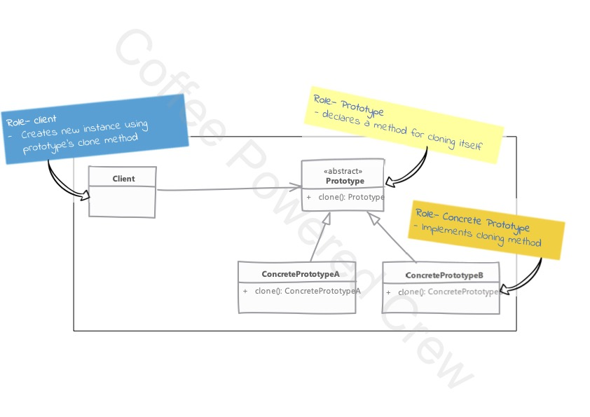

# Prototype Pattern

### Uso
 - Suele utilizarse cuando tenemos un objeto que es difícil o costoso de crear.
 - Este patrón nos permitirá generar copias del objeto existente, lo que nos 
   ahorrará el proceso de generarlo de nuevo.
 - Es útil cuando tenemos objetos grandes en los cuales los estados no suelen 
 - cambiar por un tiempo.

Al momento de utilizar este patrón se debe cuidar que el objeto y los objetos
del cual depende la clase sean generados e inicializados de forma correcta, de 
otra manera podríamos correr con algunos problemas. Si el objeto cuenta con 
propiedades mutables, éstas deberían inicializarse. Si se cuentan con muchas 
propiedades mutables, quizás este patrón no sea el más apropiado. Se debe cuidar
también que los objetos del cual depende, también sean clonables.

Se debe implementar la interfaz `Cloneable`, esto sólo como identificador de que
la clase se puede clonar.

El método `clone()` por defecto es `protected` y deberá cambiarse a público para
permitir la clonación del objeto.

