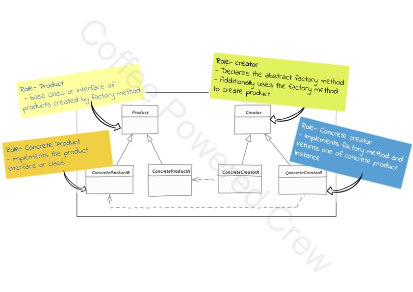

# Factory Method

### Uso
  - Se busca mover la lógica de la creación del objeto hacia una clase separada
  - Se usa este patrón cuando no tenemos una idea sobre qué clase podemos utilizar para instanciar previamente y
    también permitir que nuevas clases puedan ser creadas sin afectar el código del cliente que las consume.
  - A diferencia del **Simple Factory** donde se crean los objetos por medio de atributos en método del factory, acá
    se utilizan subclases (creadores) para determinar el tipo de objeto que crearemos sobreescribiendo el método
    factory.

Se debe cuidar de implementar este patrón desde un comienzo en el proyecto, ya que puede ser demasiado laborioso 
implementarlo después en el proyecto.

