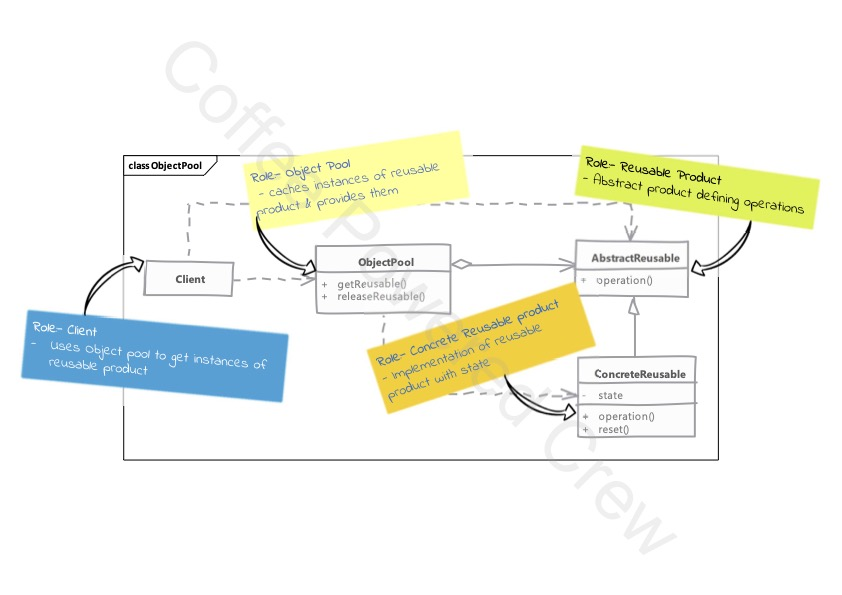

# Object Pool

### Uso

 - Si <u>es costoso crear instancias</u> de una clase y <u>se necesitan varios objetos</u> en toda la aplicación,
 entonces **Object Pool** puede ser un buen candidato.
 - Típicamente estos objetos representan recursos externos (hilos, conexiones, sockets...) que pueden llegar a ser
 limitados.
 - Objetos que serán agregados al pool deben implementar el método `reset()` que permitirá cambiar el estado de estos
una vez liberado el recurso.
 - El pool debe manejar eficientemente los problemas de sincronización y resetear el estado del objeto antes de 
regresarlo al pool para su reciclamiento.
 - El código del cliente debe liberar el recurso **siempre**, antes de regresarlo al pool para su reciclamiento. Si el
cliente falla en este punto, el sistema podría colgarse.
 - Los pools son difíciles de optimizar, pues son sensibles a la carga del sistema en tiempo de ejecución, una fuerte
demanda de los objetos podría producir derramamientos de memoria si no son gestionados de forma correcta.
 - Los pools son una buena elección cuando los objetos representan cantidades variables (pero limitadas) de recursos 
 externos.
 - Cuando se crean los objetos cuando el pool se encuentra vacío, tenemos que asegurarnos que el tamaño del pool se
mantiene estable o de otro modo terminaremos con un pool con demasiados objetos en memoria.

