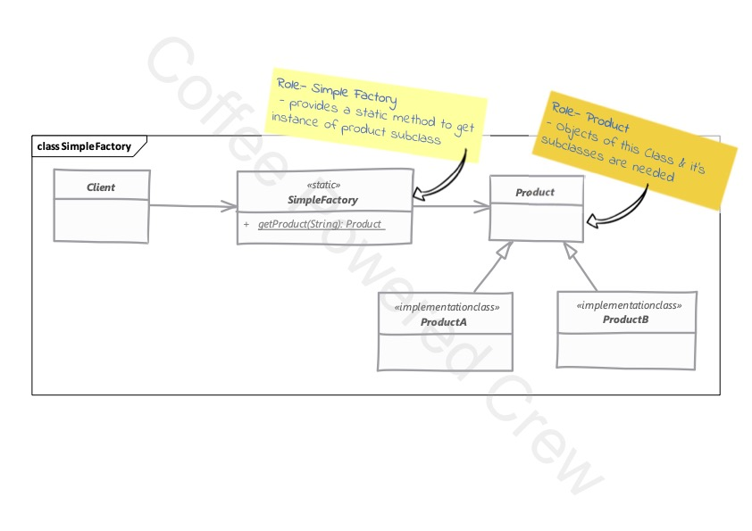

# Simple Factory

### Nota
**Simple Factory** no se considera como un patrón de desarrollo.

### Uso

Este patrón permite encapsular la lógica de creación de una serie de objetos similares, no es del todo necesario su 
implementación, pero puede resultar útil en algunos casos.

 - Simple Factory encapsula la instanciación de los objetos en un método estático por separado.
 - Podemos pasar un argumento a este método para indicar el tipo de objeto que se requiere, además se pueden pasar
   argumentos adicionales para ayudar a crear los objetos.

