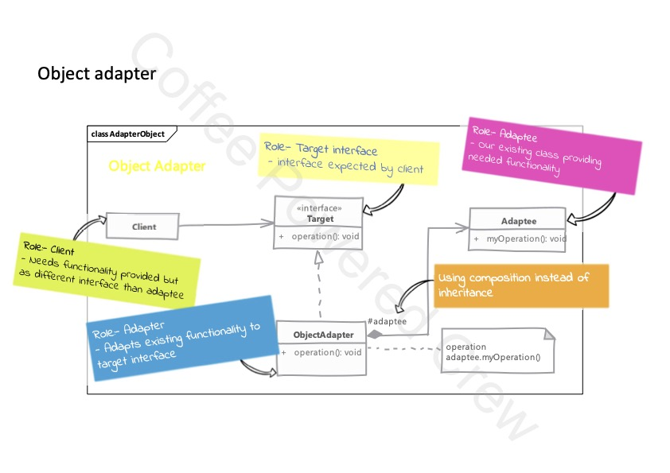

# Adapter

## Uso

 - Tenemos un objeto que requiere cierta funcionalidad, pero el código del cliente espera una interfaz distinta a la del
objeto que ya existe.
 - Existen dos modelos de adaptadores:
   1. **Class Adapter (Two-way adapter)**, es donde el adaptador hereda la funcionalidad desde la clase que se intenta 
   adaptar e implementa la interfaz requerida por el cliente. Este tipo de adaptador no debe utilizarse, pues puede 
   volver públicas algunas funcionalidades que por su naturaleza se encuentran encapsulados.
   2. **Object Adapter**, este ocupa la composición. Implementará la interfaz objetivo y utilizará la clase a adaptar 
   como una composición dentro de la clase adaptadora para realizar la traducción. Esto nos permite usar subclases 
   de la clase adaptada en el adaptador.
 - Puede resultar tentador agregar funcionalidad adicional al adaptador, esto se debe evitar pues se puede cambiar el
comportamiento del adaptador y su razón de existir.

