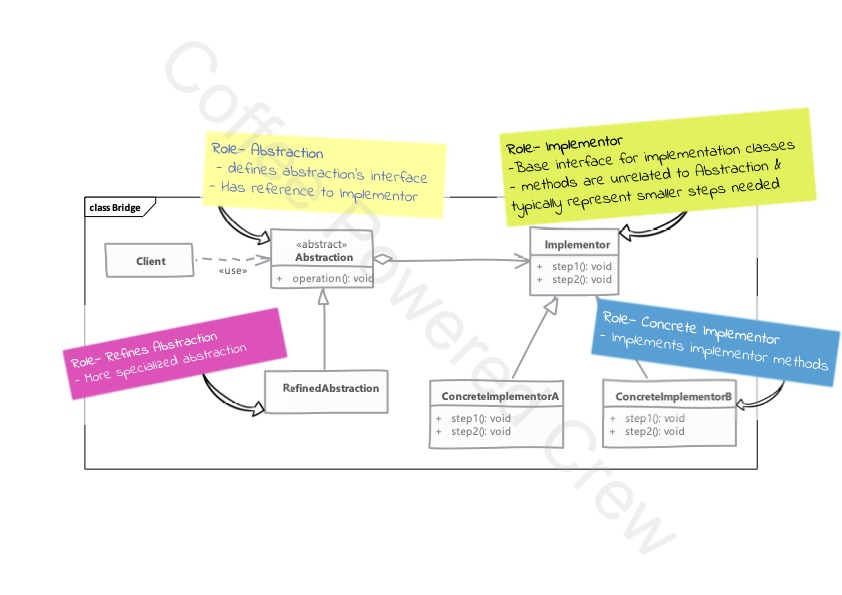

# Bridge

### Uso

 - **Bridge** es un patrón que puede resultar en un principio difícil de entender e implementar, ya que se parece a 
patrón **Adapter** en esencia. Sin embargo, tienen sus diferencias.
 - Se utiliza el patrón **Bridge** cuando se pueden implementar distintas funcionalidades definidas por una abstracción
(ojo: no se confunda con clase abstracta o interfaz), pero el cliente requiere implementar distintos métodos (por medio)
de otra abstracción y estos métodos pueden colaborar entre sí por medio de la composición de las clases.
 - Utilizamos el patrón **Bridge** cuando requerimos que nuestras abstracciones e implementaciones se encuentren 
completamente desacopladas.
 - El patrón define diferentes herencias para la abstracción e implementación y conecta estas dos utilizando la 
composición.
 - Las implementaciones no NECESITAN definir métodos que empaten con los métodos en la abstracción. Es muy común tener 
métodos primitivos; métodos que realizan pequeñas tareas en el implementador. La abstracción usa esos métodos para 
proveer la funcionalidad requerida.

