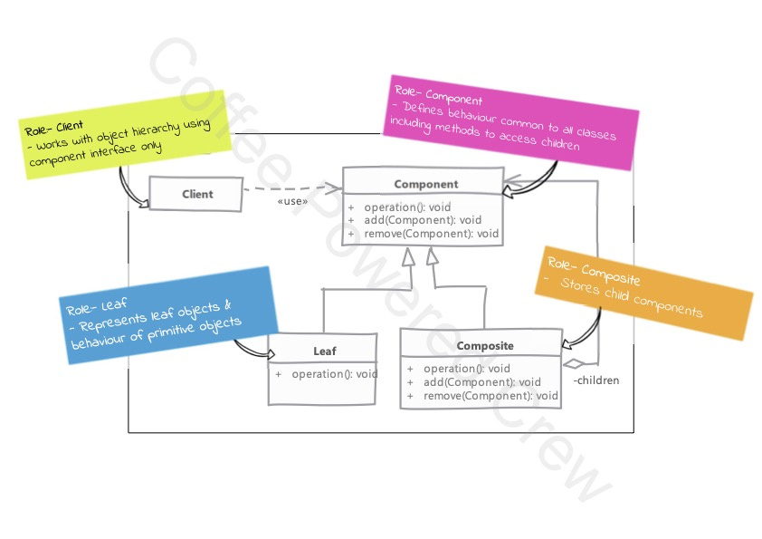

# Composite

### Uso

 - Se utiliza cuando se tiene maneja una estructura de árbol, donde existen los objetos que pueden ser de distintos 
tipos, pero que son componentes de un arreglo y un objeto componedor que delega las operaciones hacia los hijos (nodos)
y funciona como punto de acceso a los componentes que están en su interior.
 - Se tiene una relación padre-hijo o todo-parte entre los objetos. Entonces podemos utilizar el patrón `Composite` para
simplificar este arreglo de objetos.
 - El objetivo del patrón `Composite` es simplificar el código del lado del cliente permitiéndole tratar los 
compositores y nodos hijos de la misma manera.
 - Nosotros tenemos que decidir qué métodos la clase base definirá. Agregando todos los métodos aquí permitirá al
cliente tratar todos los objetos como iguales. Pero esto puede provocar que se fuerce a las clases hijas a implementar
comportamientos (métodos) no deseados.
 - Implementar este patrón con muchos (miles) nodos puede provocar problemas de performance.

