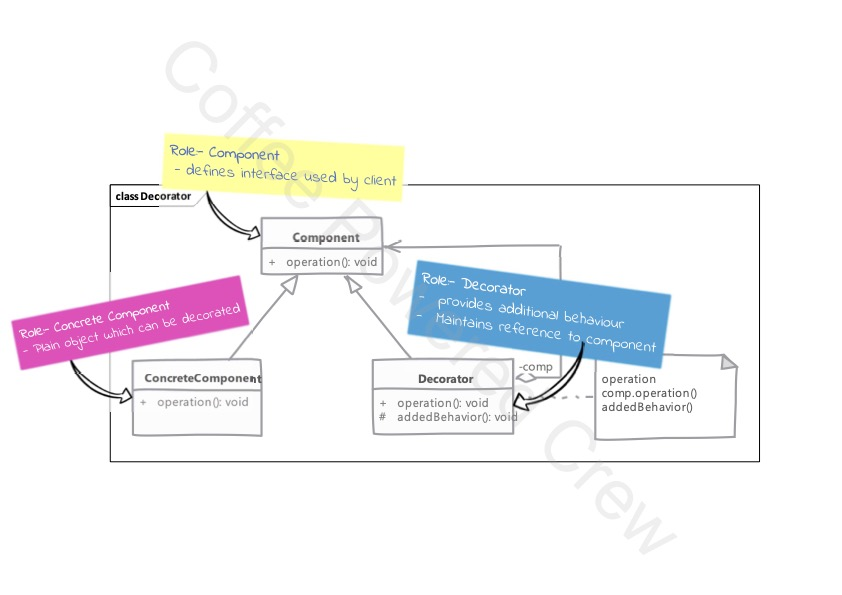

# Decorator

### Uso

 - Se ocupa el patrón **Decorator** cuando requerimos agregar un comportamiento adicional sobre un objeto existente.
 - Un **Decorator** comparte la misma interfaz del objeto al que decora o contiene.
 - Los decoradores nos permiten construir comportamientos dinámicos usando la composición. Un decorador puede envolver
otro decorador que envuelve al objeto original, es decir, los decoradores deben permitir la recursividad.
 - El cliente del objeto no sabe de la existencia del decorador.
 - No debe utilizarse como alternativa a la herencia, los decoradores agregan funcionalidad sobre la que ya existe, no
intentan cambiar el comportamiento de los objetos.
 - Existe la posibilidad de terminar con muchas clases que agregan diversas funcionalidades. Además de tener que crear
diversos objetos para ir agregando todas estas funcionalidades.

