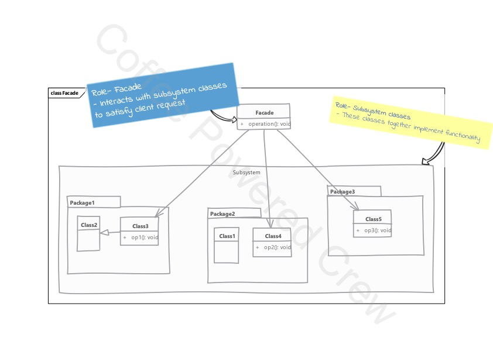

# Facade

### Uso

 - El patrón `Facade` lo usamos cuando tenemos un subsistema que requiere la implementación de varias clases e 
interfaces para el cliente. Al utilizar este patrón, implementamos una simple clase o interfase que proveerá la misma
funcionalidad.
 - `Facade` no es simplemente un método para reenviar, los métodos encapsulan las interacciones con el subsistema que de 
otra manera tendrían que realizarse en el código del cliente.
 - También sirve para trabajar sobre código antiguo o legacy, para simplificar la usabilidad y disminuir el acoplamiento 
del código del cliente hacia el código legacy.
 - No se recomienda este patrón para usarse como un gran contenedor de métodos, si se usa la inversión de dependencias 
de forma apropiada, deberíamos tener como resultado unos pocos métodos que proporcionan gran funcionalidad y 
reutilizables.

